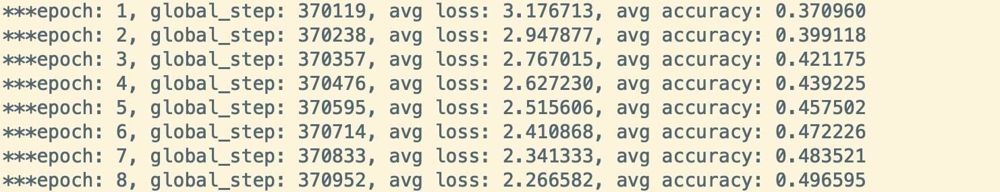
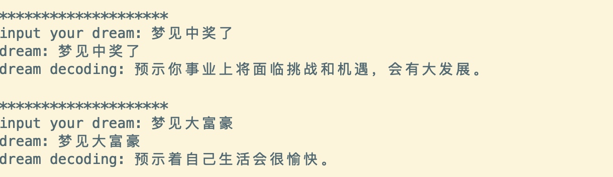

# tensorflow-seq2seq-dream-decoder

`tensorflow + seq2seq` 周公解梦。通过 `tensorflow seq2seq` 实现一个梦境解析模型，说出你的`梦境(dream)`，模型自动解析`decode`你梦境的征兆，用科学的视角对待玄学。 \^_^

## 依赖

>python >= 3.6
tensorflow 1.14.0

## 数据样例

    {
        "dream": "梦到买自行车",
        "decode": "正在对某件事情做出决定，可能会带来不好的后果。"
    }
    {
        "dream": "梦到买筐子",
        "decode": "预示着近期生活上可能会有大的开销。"
    }
    
    

**33000+**条样例[记录详情](data/data/csv)
    
## 运行

### 训练

      $ python3 model.py --task=train \
        --epoch=100 \
        --size_layer=256 \
        --vocab_file=data/vocab.txt \
        --num_layers=2 \
        --learning_rate=0.001 \
        --batch_size=16 \
        --checkpoint_dir=result

### 预测

    $ python3 model.py --task=predict \
        --epoch=100 \
        --size_layer=256 \
        --vocab_file=data/vocab.txt \
        --num_layers=2 \
        --learning_rate=0.001 \
        --batch_size=16 \
        --checkpoint_dir=result

## TODO
- [ ] add bert

**Just For Fun!!**

